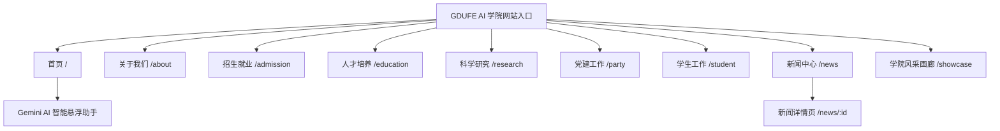

# 广东财经大学——大数据与人工智能学院官方门户网站
> **GDUFE - School of Big Data & Artificial Intelligence Official Website**

本项目是专为广东财经大学大数据与人工智能学院量身定制的响应式学术门户网站。采用 **Vue 3 (Composition API) + Vite 5 + TypeScript** 构建，在设计美学上深度融合了学院大数据与人工智能的学科特色，具备完整的二级子页面体系与全套生产环境部署方案。

---

## 🏫 页面整体结构与路由设计

本项目包含一个全屏阻尼滑动式的智能首页，以及 9 个功能完善的独立二级子页面，具体结构如下：



### 1. 首页架构 (`src/views/HomePage.vue`)
首页采用了主流学术旗舰站的全屏单页纵向滑动轨道（Full-Screen Scroll Track）设计，由六大板块纵向无缝衔接：
* **首屏大 Banner (`HeroSection.vue`)**：展示学院官方中英文名称、愿景（“数据驱动智能，创新引领未来”），以及一键跳转的引导按钮。
* **学院头条 & 讲座预告 (`NewsSection.vue`)**：双 Tab 切换架构，大焦点图配合 2x2 网格，深度整合了新注入的实景风采大图。
* **通知公告 (`NoticeSection.vue`)**：以极简学术格点风，立体展示教务公告、科研通知与学生日常通知。
* **招生视频 (`AdmissionVideoSection.vue`)**：内置 HTML5 智能首帧解码预览封面，提供顺畅的水晶磨砂蒙层与一键点击播放交互。
* **学院风采折叠卡 (`CampusShowcase.vue`)**：极具张力的多维手风琴折叠卡片，可自由伸缩展示校园风采。
* **快速通道 & 页脚 (`QuickLinks.vue` & `AppFooter.vue`)**：提供常用外部链接与学院的官方版权及备案信息。
* **AI 智能助手 (`GeminiChatOverlay.vue`)**：常驻右下角，点击可平滑横向拉出磨砂玻璃质感的 Gemini 智能聊天面板。

---

### 2. 独立二级子页面体系

#### 📂 关于我们 (`src/views/AboutPage.vue`)
* **核心内容**：包含「学院概况」、「现任领导」与「机构设置」三大核心卡片板块。
* **特色排版**：采用精美磨砂水晶卡片排版，结合科技蓝/深蓝渐变线条，细致描述学院师资规模、学科地位等指标。

#### 📂 招生就业 (`src/views/AdmissionPage.vue`)
* **核心内容**：展示最新的「招生动态」、「特色专业」与「就业质量」数据。
* **特色排版**：融合了动态图表式的亮点数据指标卡，并为计算机科学、人工智能、大数据管理、信息安全四大核心专业设计了直观的亮点亮点对比展示。

#### 📂 人才培养 (`src/views/EducationPage.vue`)
* **核心内容**：包含「专业建设」、「实践教学」与「学生获奖」三个维度的系统介绍。
* **特色排版**：精美的时间轴（Timeline）与微晶格卡片，展示学院卓越人才培养方案、校企联合实验室及历年学科竞赛辉煌成果。

#### 📂 科学研究 (`src/views/ResearchPage.vue`)
* **核心内容**：涵盖「科研动态」、「学术团队」与「科研平台」三大版块。
* **特色排版**：学术风气浓厚的列表展示，凸显国家自然科学基金重点项目及省部级联合创新平台的丰硕科研实力。

#### 📂 党建工作 (`src/views/PartyPage.vue`)
* **核心内容**：展示「党建要闻」、「主题教育」与「支部风采」信息。
* **特色排版**：采用端庄大气的中国红配以学院科技蓝的多维渐变风格，全面展示学院基层的先进性与思想建设成果。

#### 📂 学生工作 (`src/views/StudentPage.vue`)
* **核心内容**：聚焦于「学生活动」、「奖助体系」与「日常事务」三大板块。
* **特色排版**：卡片网格布局，全方位立体展现第二课堂、社团活动、卓越学子奖学金以及班主任导学机制。

#### 📂 新闻中心 (`src/views/NewsPage.vue`)
* **核心内容**：学院全部历史新闻与学术讲座的集中信息流列表。
* **特色排版**：无缝支持 `#headlines`（学院头条）和 `#lectures`（讲座预告）锚点定位，从首页点击 MORE 按钮可精准路由并自动高亮切换对应 Tab。

#### 📂 新闻详情页 (`src/views/NewsDetailPage.vue`)
* **核心内容**：结构完整的新闻/讲座正文展示页。
* **特色排版**：支持面包屑导航、发布时间、点击量、正文排版（大字号、适宜行高），并带有一键返回新闻列表的微交互。

#### 📂 学院风采画廊 (`src/views/ShowcasePage.vue`)
* **核心内容**：高保真沉浸式实景画廊展墙。
* **特色排版**：
  * **分类筛选**：支持「全部」、「教学科研」、「学术交流」、「第二课堂」、「美丽校园」无极筛选切换；
  * **幻灯片自动轮播 (Lightbox)**：点击任意图片拉起沉浸式黑底大图弹窗，支持键盘左右键及 Esc 操控，并拥有可控制的自动放映（Autoplay）进度条圆环动效。

---

## 🛠️ 技术栈

* **核心框架**：Vue 3 (Composition API)
* **构建工具**：Vite 5
* **编程语言**：TypeScript
* **路由管理**：Vue Router (基于 History 模式的单页路由)
* **矢量图标**：Lucide Vue Next
* **样式系统**：Vanilla CSS (纯手工定制，高度优化资源大小并杜绝全局冲突)

---

## 📂 项目文件目录结构

```text
gdufe-info-web/
├── dist/                   # 生产环境编译打包输出目录 (打包后自动生成)
├── src/
│   ├── assets/             # 静态资源中心
│   │   ├── images/         # 整合优化后的图片目录 (已清除根目录所有冗余图片)
│   │   │   ├── 1.jpg ~ 5.jpg           # 学院风采实景图 (用于新闻与风采展示)
│   │   │   ├── newlogo.png             # 官方规范 Logo
│   │   │   ├── 佛山校区.jpg             # 首页主 Banner 大图
│   │   │   ├── subpage_banner_bg.png   # 全站子页面通用的 Banner 磨砂底图
│   │   │   ├── 院徽.png & 校徽.svg      # 官方标准标识
│   │   │   └── gdufe_sports_day.png    # 教师运动会备用大图
│   │   └── video/          # 视频资源目录
│   │       └── a5050563-290c-4da4-bc3a-974d5b6e2acb.mp4  # 招生宣传视频
│   ├── components/         # 组件目录
│   │   ├── home/           # 首页各板块组件 (NewsSection, AdmissionVideoSection 等)
│   │   └── layout/         # 全局布局组件 (AppHeader, AppFooter, GeminiChatOverlay 等)
│   ├── data/               # 静态数据中心 (使用 ESM 模块化安全引用本地图片)
│   ├── router/             # 路由配置 (基于 history 模式的响应式子页面导航)
│   ├── views/              # 页面视图 (AboutPage, NewsPage, ShowcasePage 等独立子页面)
│   ├── App.vue             # 主应用入口
│   └── main.ts             # 挂载入口
├── vite.config.ts          # Vite 核心配置文件
└── package.json            # 依赖与脚本定义
```

---

## 🚀 本地开发指南

在本地开始运行或开发此项目，请确保已安装 **Node.js (v18.0 或更高版本)**。

### 1. 克隆项目
```bash
git clone https://github.com/fewhuooo/gdufe-info-web.git
cd gdufe-info-web
```

### 2. 安装依赖项
```bash
npm install
```

### 3. 启动开发服务器
```bash
npm run dev
```
启动成功后，在浏览器中打开命令行提示的地址（通常为 `http://localhost:5173/`）即可开启开发预览。

---

## 🌐 生产部署指南

当开发完成，需要将项目打包部署至服务器上时，请参考以下部署流程。

### 1. 项目打包编译
在项目根目录运行以下命令：
```bash
npm run build
```
编译完成后，Vite 将会在根目录下生成一个 `dist` 文件夹。该文件夹包含了所有经过压缩、混淆、哈希重命名的 HTML、CSS、JavaScript 以及图片和视频资源。**您只需要将 `dist` 文件夹内的内容发布到您的静态 Web 服务器即可。**

---

### 2. 常用 Web 服务器配置示例

由于本项目使用了 Vue Router 的 `History 模式`，为保证用户刷新子页面（例如 `/about`、`/news`）时不会出现 **404 Not Found** 错误，您需要在服务器上配置 **单页应用 (SPA) 路由重定向 fallback**。

#### A. Nginx 配置示例
编辑您的虚拟主机配置文件，在 `server` 块中加入 `try_files` 配置：
```nginx
server {
    listen       80;
    server_name  your-college-domain.com;

    location / {
        root   /var/www/gdufe-info-web/dist; # 指向您的打包 dist 实际路径
        index  index.html index.htm;
        
        # 核心配置：如果请求的文件不存在，自动 fallback 重定向到 index.html
        try_files $uri $uri/ /index.html;
    }

    # 针对静态大资源（视频、高清图片）的缓存配置（可选）
    location ~* \.(mp4|jpg|jpeg|png|gif|svg|ico|css|js)$ {
        root /var/www/gdufe-info-web/dist;
        expires 7d;
        add_header Cache-Control "public, no-transform";
    }
}
```

#### B. 静态托管配置 (阿里云 OSS / 腾讯云 COS)
* 如果使用静态托管托管服务，请在控制台的「静态网站托管」或「基础设置」中，将 **「默认首页」** 和 **「错误文档/404页面」** 均设置为 `index.html`。这会自动开启 History 路由 fallback 功能。

#### C. Vercel 部署
若将项目部署于 Vercel，可在项目根目录下创建 `vercel.json` 文件，内容如下以自动处理 SPA 重定向：
```json
{
  "rewrites": [
    { "source": "/(.*)", "destination": "/index.html" }
  ]
}
```

---

## 🤝 贡献与支持

如有任何设计微调需求或功能更新设想，欢迎向本仓库提交 Pull Request 或发起 Issue。广东财经大学大数据与人工智能学院官方门户网站开发团队将竭诚为您服务！

* **Design Concept by**: Antigravity (Powered by Google Deepmind)
* **Author / Code Maintainer**: fewhuooo
